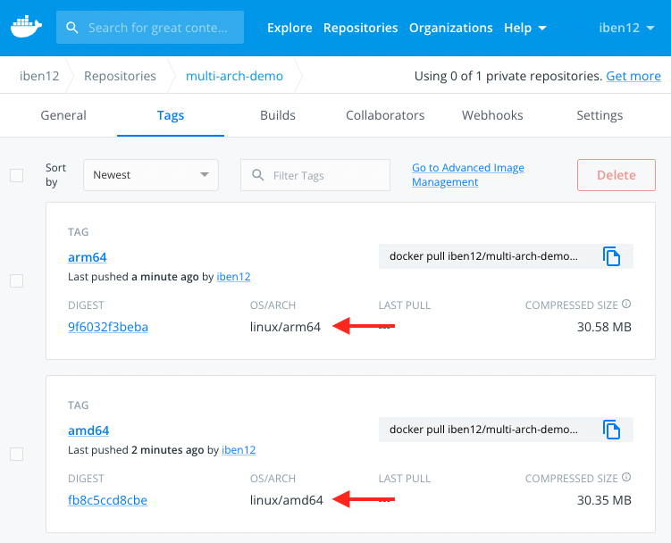
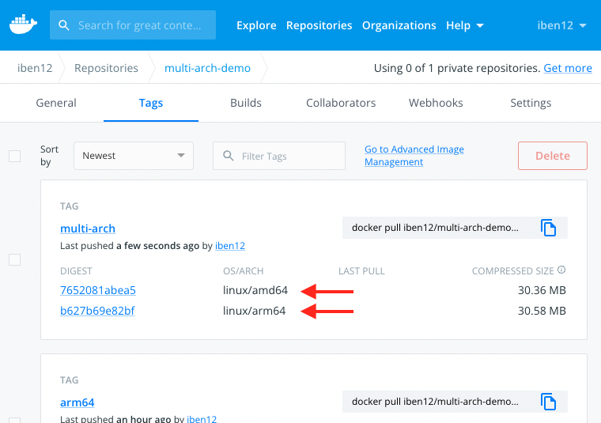
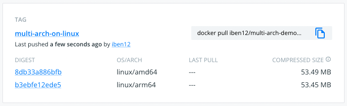

# How to build multi-arch images with Docker Buildx

This repo gives an example for Buildx multi-arch capabilities.

## Why multi-arch

Use-cases:
- dockerized internal tool (intended to run on Intel-based and Apple Silicon machines)
- build on x_86 for ARM and vica-versa (ex. from Intel laptop to your RaspberryPi home lab)
- using ARM-based cloud services (Google TAU, AWS Graviton, etc)

## How it works?

Docker Desktop (Mac, Windows, Linux) contains [QEMU](https://www.qemu.org/) which can emulate several architectures by translating CPU instructions to the target architecture on the fly. Of course, this has some performance penalty and you can run into issues with syscalls not implemented in the emulator.

## Cross-build with `docker build` (Docker Desktop)

> **_NOTICE:_** I do this how-to on an Apple Silicon machine if not stated otherwise.

For convenience I will set the image repository as an env variable. If you follow along the commands will just work as is.
```bash
export IMAGE_REPO=iben12/multi-arch-demo
```

By default docker detects your current platform and will build for that using base images if they're available.
```bash
docker build -t ${IMAGE_REPO}:native .
...
docker run --rm ${IMAGE_REPO}:native arch
# aarch64 or x86_64 depending on your environment
```


Since Docker Desktop installs QEMU by default, you can just use the `docker build` command with the `--platform` flag to cross-build to different architectures.
From ARM to x86
```bash
docker build --platform linux/amd64 -t ${IMAGE_REPO}:amd64 .
...
docker run --rm ${IMAGE_REPO}:amd64 arch
# x86_64
```
or from x86 to ARM
```bash
docker build --platform linux/arm64 -t ${IMAGE_REPO}:arm64 .
...
docker run --rm ${IMAGE_REPO}:arm64 arch
# aarch64
```

> **_NOTE:_** This won't work on default Docker Engine installs on Linux systems, but we're going to come back to it later.

Let's see how can we distribute these images:

Tag our native image with the corresponding platform:
```bash
docker tag ${IMAGE_REPO}:native ${IMAGE_REPO}:<your-arch>
docker rmi ${IMAGE_REPO}:native
```
then let's push them to Docker Hub registry:
```bash
docker push ${IMAGE_REPO} --all-tags
```
So far we have both images in the repo with the corresponding tags:



The drawaback here is that we always have to take care of pulling the right tag for the current platform. This leads to a lot of burden and ends up in shell scripts like below or other dirty tricks to really work platform independently:
```bash
if [[ $(arch) = "arm64" ]]; then
  # pull ARM image
else
  # ...
```

## Enter Buildx multi-arch (with Docker Desktop)

From Docker Docs:

> Docker Buildx is a CLI plugin that extends the docker command with the full support of the features provided by Moby BuildKit builder toolkit.

The Buildx plugin is installed on our machines by default if we run Docker Desktop or installed Docker Engine on Linux via package manager.

If you look at the [Buildx documentation](https://docs.docker.com/build/buildx/multiplatform-images/), you can see that it supports building for multiple platforms in one go:
```bash
docker buildx build --platform linux/amd64,linux/arm64 -t ${IMAGE_REPO}:multi-arch .

# error: multiple platforms feature is currently not supported for docker driver. Please switch to a different driver (eg. "docker buildx create --use")
```

We run into this error because the default builder does not support multi-platform builds, so let's just follow the advice and create our custom builder:
```bash
docker buildx create --name multi-arch --use
```

This creates a new builder and set it to active, so any consecutive buildx commands will use our new builder.

So let's try the build again:
```bash
docker buildx build --platform linux/amd64,linux/arm64 -t ${IMAGE_REPO}:multi-arch .
```

That worked this time.

> **_WARNING_**: This will still fail on Linux systems not runnig Docker Desktop, because QEMU is needed for cross-build. We will solve that in the next section.

We may also notice that this started a new docker container which is the actual buildx instance where the build runs:
```bash
docker ps

# CONTAINER ID   IMAGE                           COMMAND       CREATED         STATUS         PORTS     NAMES
# 38ffdf28d79d   moby/buildkit:buildx-stable-1   "buildkitd"   2 minutes ago   Up 2 minutes             buildx_buildkit_multi-arch0
```

At the end buildx printed a warning:
```
WARNING: No output specified for docker-container driver. Build result will only remain in the build cache. To push result image into registry use --push or to load image into docker use --load
```

This suggests that we cannot use the image that we've just built. And indeed, if we list our images, we will not see the new image tagged with `:multi-arch`, just the previous builds:
```bash
docker image ls | grep ${IMAGE_REPO}

# iben12/multi-arch-demo   amd64             3c7c3f1964c4   40 minutes ago   95.2MB
# iben12/multi-arch-demo   arm64             f6b7d5638a88   2 hours ago      95.5MB
```

As Buildx runs in a container the built image will remain in the container unless we instruct Buildx otherwise. We have two options:
- `--load`: will load the built image into the host machine docker images. **This works for single-platform builds only.**
- `--push`: this will push the images and the _manifest list_ to the registry.

Let's build with `--push` then:
```bash
docker buildx build --platform linux/amd64,linux/arm64 -t ${IMAGE_REPO}:multi-arch . --push
```

If we look at our repo now, we will see a single image tag containing the images for both platforms:



OK, but what is that _manifest list_? This is exactly what makes it multi-arch possible: it's a JSON file describing the images for all platforms we built for. We can see that with the `imagetools` command.
```bash
docker buildx imagetools inspect ${IMAGE_REPO}:multi-arch
```
The output looks similar to this:
```
Name:      docker.io/iben12/multi-arch-demo:multi-arch
MediaType: application/vnd.docker.distribution.manifest.list.v2+json
Digest:    sha256:fdf7439339f017ffa0fbbb1f786246dd7a1e4a98ae787cd625315b9e46e56470
           
Manifests: 
  Name:      docker.io/iben12/multi-arch-demo:multi-arch@sha256:7652081abea5fa4ed75604b254f52ef7be033f9bf0d39ef4d4f6b8a93dbe5d77
  MediaType: application/vnd.docker.distribution.manifest.v2+json
  Platform:  linux/amd64
             
  Name:      docker.io/iben12/multi-arch-demo:multi-arch@sha256:b627b69e82bf1efc95a18d9ca615c6db31d1390b954d27a07059b17aba27182d
  MediaType: application/vnd.docker.distribution.manifest.v2+json
  Platform:  linux/arm64
```

As we can see it contains the manifests for both platforms. This makes it possible for Docker to decide which one to pull when you want to run the image: it will try to pull the image built for your current platform, or fall back if it's not available.

## Buildx multi-arch (Docker Engine on Linux)

> **_NOTICE:_** Here I switch to a x86 Linux VM in the cloud that runs on Debian Bullseye, Docker is installed via the [convenience script](https://docs.docker.com/engine/install/debian/#install-using-the-convenience-script).

I will clone our working repository on the machine by (you may need to install `git cli`):
```bash
git clone https://github.com/iben12/multi-arch-build.git

cd multi-arch-build/
```

First we have to create a custom builder to enable multi-platform builds:
```bash
docker buildx create --name multi-arch --use
```

Let's try to build the multi-arch image as we did earlier:
```bash
export IMAGE_REPO=iben12/multi-arch-demo
docker buildx build --platform linux/amd64,linux/arm64 -t ${IMAGE_REPO}:multi-arch-on-linux . --push
```

This will run into an error:
```
=> ERROR [linux/arm64 4/4] RUN npm i                                                                                                        0.2s
------
 > [linux/arm64 4/4] RUN npm i:
#0 0.181 Error while loading /usr/local/sbin/node: No such file or directory
```

This is not very descriptive, it tells us it did not find the `node` binary where it should be. However, the `arm64` build crashed, which is a hint.

Let's inspect our builder:
```bash
docker buildx ls
```
```
NAME/NODE     DRIVER/ENDPOINT             STATUS  PLATFORMS
multi-arch *  docker-container
  multi-arch0 unix:///var/run/docker.sock running linux/amd64, linux/amd64/v2, linux/amd64/v3, linux/386
default       docker
  default     default                     running linux/amd64, linux/386
```

As we see, our builders are only able to build for x86 platforms. If we compare it to the output on machine with Docker Desktop we see the following:
```
NAME/NODE       DRIVER/ENDPOINT             STATUS  PLATFORMS
multi-arch *    docker-container                    
  multi-arch0   unix:///var/run/docker.sock running linux/arm64, linux/amd64, linux/amd64/v2, linux/riscv64, linux/ppc64le, linux/s390x, linux/386, linux/mips64le, linux/mips64, linux/arm/v7, linux/arm/v6
desktop-linux   docker                              
  desktop-linux desktop-linux               running linux/arm64, linux/amd64, linux/riscv64, linux/ppc64le, linux/s390x, linux/386, linux/arm/v7, linux/arm/v6
default         docker                              
  default       default                     running linux/arm64, linux/amd64, linux/riscv64, linux/ppc64le, linux/s390x, linux/386, linux/arm/v7, linux/arm/v6
```

As you may expect, we need the emulator to go forward. [Docker Docs](https://docs.docker.com/build/buildx/multiplatform-images/) describes it this way:
> QEMU is the easiest way to get started if your node already supports it (for example. if you are using Docker Desktop). It requires no changes to your Dockerfile and BuildKit automatically detects the secondary architectures that are available. When BuildKit needs to run a binary for a different architecture, it automatically loads it through a binary registered in the `binfmt_misc` handler.

Fortunately Tonis Stiigi created a simple image to install and register all needed components:
```bash
docker run --privileged --rm tonistiigi/binfmt --install all
```

If we look at our builders again, we'll see that now we are able to target non-x86 platforms as well:
```bash
docker buildx ls
```
```
NAME/NODE     DRIVER/ENDPOINT             STATUS  PLATFORMS
multi-arch *  docker-container
  multi-arch0 unix:///var/run/docker.sock running linux/amd64, linux/amd64/v2, linux/amd64/v3, linux/386, linux/arm64, linux/riscv64, linux/ppc64le, linux/s390x, linux/mips64le, linux/mips64
default       docker
  default     default                     running linux/amd64, linux/386, linux/arm64, linux/riscv64, linux/ppc64le, linux/s390x, linux/arm/v7, linux/arm/v6
```

We're ready to build and push our image to the registry from here now, except we need to docker login if didn't yet:
```bash
docker login

# ...
# Login Succeeded
```

Run the build again:
```bash
docker buildx build --platform linux/amd64,linux/arm64 -t ${IMAGE_REPO}:multi-arch-on-linux . --push
```

We see the new tag and the images for both platforms as expected:



That's fine, but we don't usually just build our images on our laptops, so how do we intagrate this into the CI pipeline?

## Automate multi-arch build (with GitHub Actions)

To achive this we have to set up the CI build environment the same way as we did on our Linux box. Well, that's a bit complicated (doable, however), but fortunately GitHub Actions has a [marketplace](https://github.com/marketplace?type=actions) of prebuild actions where there is one (or more) for our purpose: [crazy-max/ghaction-docker-buildx@v1](https://github.com/marketplace/actions/docker-buildx) that takes care about installing Buildx, QEMU and configuring the whole multi-platform environment for us.

Look at the [build.yaml](.github/workflows/build.yml) file. The insteresting part happens here:
```yaml
      - name: Install buildx
        id: buildx
        uses: crazy-max/ghaction-docker-buildx@v1
        with:
          buildx-version: latest
          qemu-version: latest
      - name: Login to Docker Hub
        uses: docker/login-action@v2
        with:
          username: ${{ secrets.DOCKER_USER }}
          password: ${{ secrets.DOCKER_PASSWORD }}
      - name: Build and push the image
        run: |
          docker buildx build --push \
            --tag ${{ secrets.DOCKER_USER }}/multi-arch-demo:${{ github.sha }} \
            --platform linux/amd64,linux/arm/v7,linux/arm64 .
```

First we `Install buildx` with the mentioned prebuilt action, then we `Login to Docker Hub` with the next one, finally we build the multi-platform image with the now familiar command and tag it with the commit hash.

> **_NOTICE:_** For the login step you have to set up **secrets** with your docker credentials (username and a generated token) in your repository. To do this on GitHub go to **Settings -> Secrets (left side menu) -> Actions (from the drop-down)**.

When we push this into our repository, it will trigger our workflow and at the end we will have our new tag in the Docker Registry.